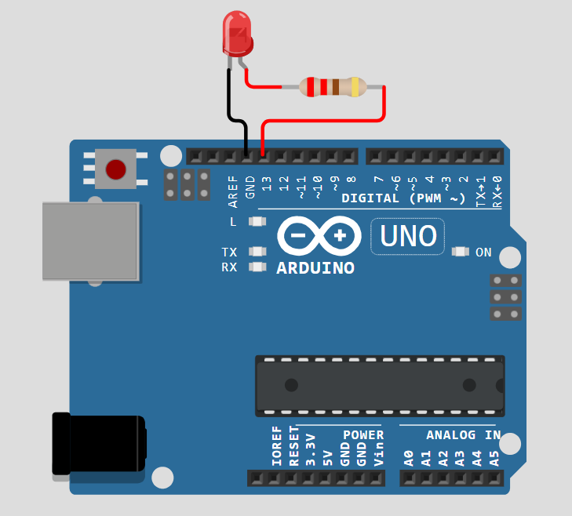

# Blink LED Program

## Introduction

This project demonstrates a simple LED blinking program using an Arduino. The LED turns ON for 1 second and then OFF for 1 second in an infinite loop. This is one of the basic projects for beginners to understand microcontroller programming and GPIO control.

## Hardware Requirements

- **Arduino board** (e.g., Arduino Uno, Nano, etc.)
- **LED** (typically a 5mm LED with a forward voltage of ~2V)
- **Resistor** (to limit current through the LED)
- **Connecting wires** (to establish connections)
- **Breadboard** (optional, for easy prototyping)
- **USB cable** (for programming and power supply to the Arduino)

## Working Principle

The Arduino board has GPIO (General-Purpose Input/Output) pins that can be programmed to control external components such as LEDs, motors, and sensors. In this project, we use **digital pin 13** to control the LED. The program turns the LED ON and OFF at regular intervals using **digitalWrite()** and **delay()** functions.

## Resistor Calculation

To protect the LED and ensure safe operation, a current-limiting resistor is required. The resistor value is calculated using Ohm's Law:

**Formula:**
 R = (V_supply - V_LED) / I

Where:
- **V_supply** = 5V (Arduino GPIO output voltage)
- **V_LED** = 2V (Forward voltage drop of the LED)
- **I** = 10-20mA (Safe operating current range for the LED)

**Calculation:**

- For **10mA** current: \[ R = \frac{5V - 2V}{0.01A} = 300\Omega \]
- For **20mA** current: \[ R = \frac{5V - 2V}{0.02A} = 150\Omega \]
- A **220Ω resistor** is commonly used, limiting the current to approximately 13.6mA.

## Circuit Diagram


1. Connect the **positive (longer) leg** of the LED to **pin 13** of the Arduino.
2. Connect a **220Ω resistor** in series with the **negative (shorter) leg** of the LED.
3. Connect the other end of the resistor to **GND (ground)** on the Arduino.

Try the simulation of this project online: [Wokwi Simulation](https://wokwi.com/projects/422324100418215937)

## Arduino Code

```cpp
#define ledPin 13  // Define the digital pin for the LED

void setup() {
  pinMode(ledPin, OUTPUT); // Set the LED pin as an OUTPUT
}

void loop() {
  digitalWrite(ledPin, HIGH); // Turn ON the LED
  delay(1000); // Wait for 1 second
  digitalWrite(ledPin, LOW); // Turn OFF the LED
  delay(1000); // Wait for 1 second
}
```

## Explanation of Code

- **setup():** Runs once when the Arduino is powered on. It initializes pin 13 as an output.
- **loop():** Runs continuously:
  - Turns the LED ON (`digitalWrite(ledPin, HIGH)`).
  - Waits for **1000 milliseconds (1 second)**.
  - Turns the LED OFF (`digitalWrite(ledPin, LOW)`).
  - Waits for another **1000 milliseconds (1 second)**.

## Modifications and Experimentation

- **Changing Blink Speed:** Modify the delay values to increase or decrease the LED blinking rate.
- **Using Different Pins:** Instead of pin 13, try using other digital pins (e.g., pin 7, pin 8) and update the `#define ledPin` accordingly.

## Expected Output

- The LED will blink with a 1-second ON and 1-second OFF cycle indefinitely.

## Troubleshooting

- **LED Not Blinking:** Check the connections, especially the resistor and polarity of the LED.
- **Dim LED:** Use a lower resistance (e.g., 150Ω) to allow more current flow.
- **Wrong Pin Used:** Ensure the correct pin number is defined in the code.

## Notes

- If using an external LED instead of the built-in LED on pin 13, ensure a **resistor** is used to avoid excessive current.
- The internal LED on the Arduino board is also connected to pin 13 and will blink in sync with an external LED.
- The same logic can be applied to control other output devices, such as buzzers or relays.

## Applications

- Basic electronics learning
- Microcontroller programming practice
- Visual indicators in automation projects
- Debugging aid for other Arduino projects